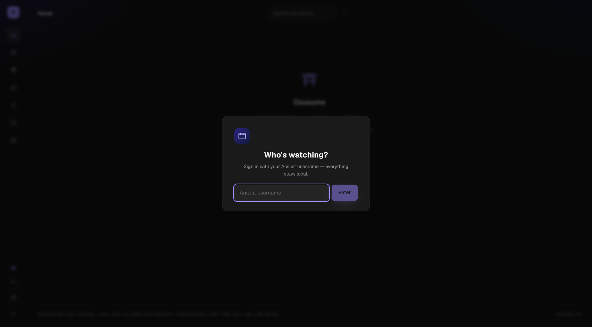
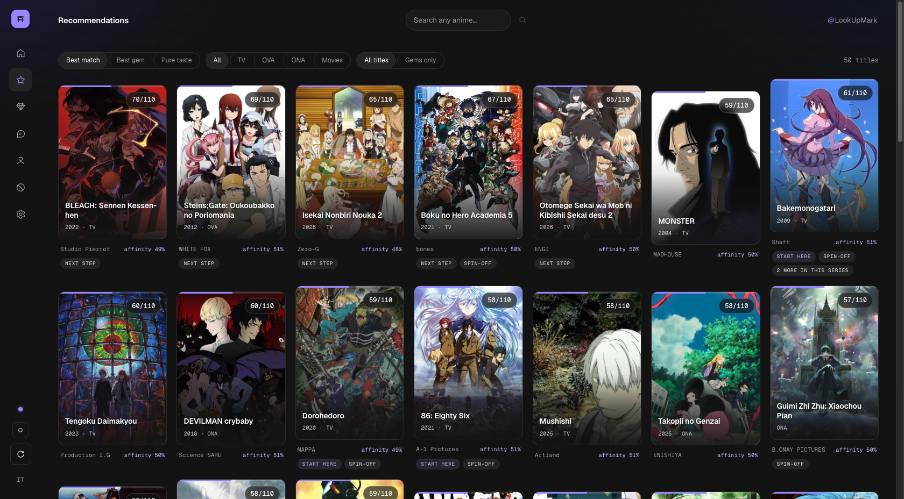
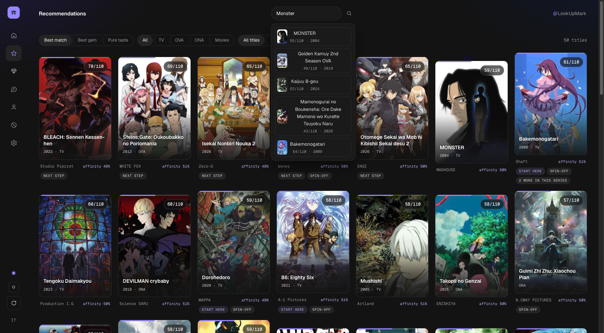
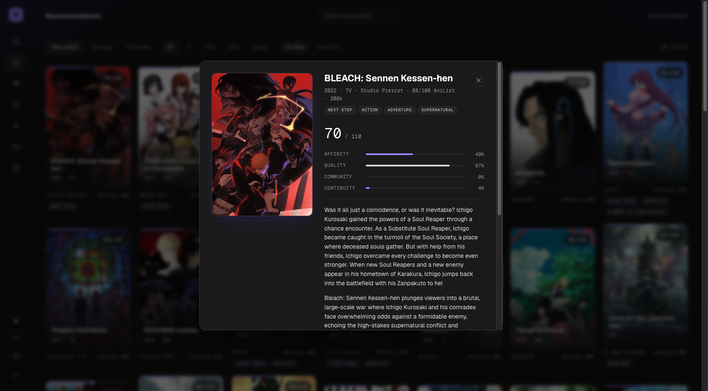
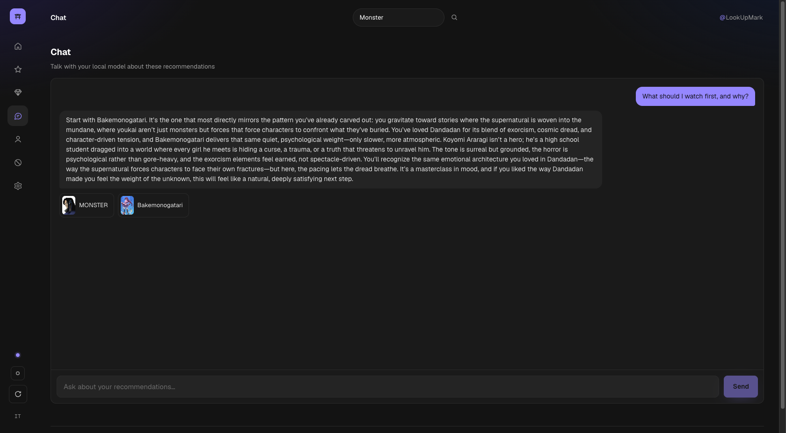
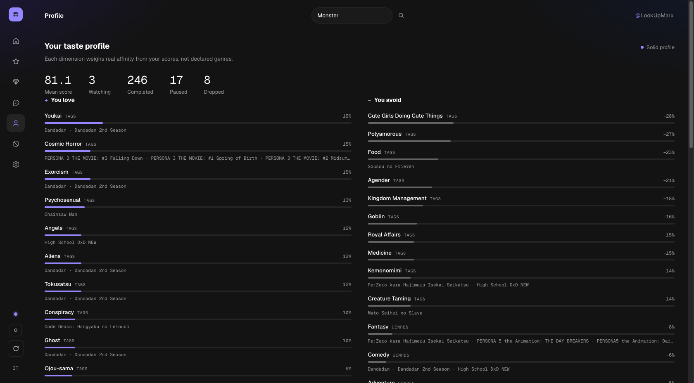
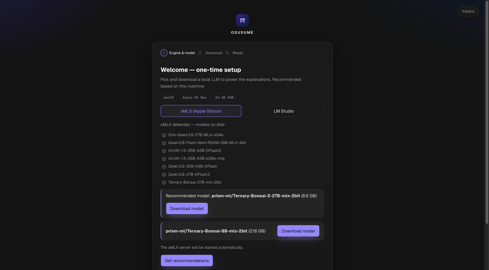
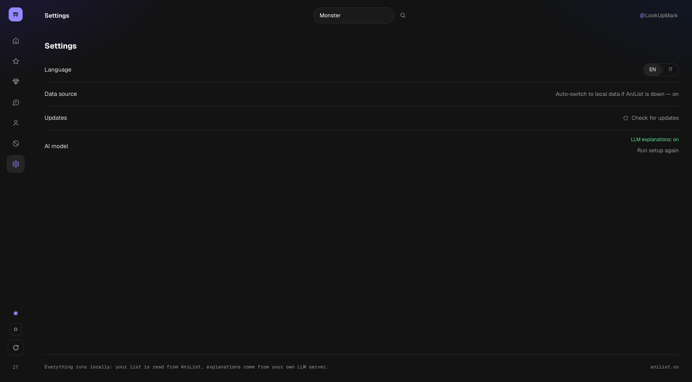

# Osusume

Personalized anime recommendations from your own AniList list — with explanations, hidden gems, and franchise awareness. Everything runs locally: the recommendation engine is deterministic and inspectable, and the narrative explanations come from **your own LLM server** (Ollama, LM Studio, or any OpenAI-compatible endpoint). No cloud, no accounts.

| | |
|---|---|
|  |  |
|  |  |
|  |  |
|  |  |

_Screenshots from a real run with the AniList user **LookUpMark** — fake login, recommendations, anime search scored against your taste, on-demand LLM explanations, chat with clickable title cards, taste profile, setup wizard and settings._

## Why this one

Every existing recommender misses at least one of these (verified 2026-09, see `docs/competitors.md`):

- **Dropped/paused as signal** — what you abandoned shapes what gets recommended *away*.
- **Franchise-aware** — never recommends S2 without S1; tells you where to start a long series; excludes series you dropped.
- **Explained picks** — a deterministic breakdown (taste / quality / community) plus optional LLM narration grounded in your real list. Also *anti-recommendations*: what to avoid and why.
- **Hidden gems** — low-popularity, high-fit titles surfaced with an explicit popularity control, not buried by it.

## Quickstart

### macOS app (DMG)

Download `Osusume-<version>-arm64.dmg` from the [latest release](https://github.com/LookUpMark/osusume/releases/latest), open it and drag the app to Applications.

The build is **unsigned** (no Apple Developer ID): on first launch macOS may block it — **right-click the app → Open → Open** (once), or if it reports the app as damaged, run `xattr -cr "/Applications/Osusume.app"`. The app checks GitHub releases on startup: when a new version is out, an arrow chip appears in the sidebar — clicking it opens the release page for the new DMG (updates are manual by design while the app is unsigned). Data lives in `~/Library/Application Support/Osusume/`.

Build it yourself: `pnpm dist:mac` (output in `release/`).

### Windows installer

Download `Osusume-Setup-<version>.exe` from the [latest release](https://github.com/LookUpMark/osusume/releases/latest) and run it. The build is **unsigned**: SmartScreen may warn — **More info → Run anyway**. Same update chip in the sidebar; data lives in `%APPDATA%\Osusume\`.

Build it yourself: `pnpm dist:win` (on Windows; output in `release/`).

### Linux AppImage

Download `Osusume-<version>.AppImage` from the [latest release](https://github.com/LookUpMark/osusume/releases/latest), then:

```bash
chmod +x Osusume-<version>.AppImage
./Osusume-<version>.AppImage
```

Data lives in `~/.config/Osusume/`.

Build it yourself: `pnpm dist:linux` (on Linux; output in `release/`).

### Docker (fewest commands)

```bash
docker compose up -d
# open http://localhost:3000 — app + Ollama + Bonsai model, no wizard, no Node needed
```

Full mode wires an Ollama container automatically (`LLM_BASE_URL` env) and pulls the model on first start (~6.7 GB for Ternary-Bonsai-27B, no-op afterwards). Pick a smaller model on <16 GB hosts: `ANILIST_MODEL=hf.co/prism-ml/Ternary-Bonsai-8B-gguf docker compose up -d`. GPU (Linux+NVIDIA): uncomment the `deploy.resources` block in `compose.yaml`.

**macOS**: Docker runs Linux in a VM without GPU — if you already run LM Studio on the host, prefer app-only mode (see the header of `compose.yaml`): the wizard then points at `http://host.docker.internal:1234/v1`.

### Node (local dev)

Requires Node ≥ 22.18 and pnpm (or `corepack enable`).

```bash
pnpm install
pnpm dev
# open http://127.0.0.1:3000
```

On first launch a **setup wizard** appears: it detects your hardware (chip, RAM) and suggests a model — [Ternary-Bonsai-27B](https://huggingface.co/prism-ml/Ternary-Bonsai-27B-gguf) (6.7 GB) on ≥16 GB machines, Ternary-Bonsai-8B (2 GB) below. One click installs the LM Studio CLI if missing (official installer scripts, run as fixed commands), one click downloads the model, and from then on **every app start brings the LM Studio server up with your model automatically** (daemon → server → load, logged to `data/llm.log`).

- Skip the wizard anytime: the app works fully without an LLM (deterministic explanations).
- Prefer your own endpoint (Ollama, LM Studio GUI, llama.cpp server…)? Set `LLM_BASE_URL` in `.env` (see `.env.example`) — the wizard stays out of the way.
- Ternary (2-bit) Apple MLX variants of Bonsai are selectable in the wizard. On Apple Silicon with [oMLX](https://github.com/PrismML-Eng) the wizard offers **[Ternary-Bonsai-2-27B-mlx-2bit](https://huggingface.co/prism-ml/Ternary-Bonsai-2-27B-mlx-2bit)** (8.6 GB, downloaded straight into oMLX). The LM Studio MLX checkbox stays on the 8B v1 pack: Bonsai-2 packings (GGUF and MLX) require the PrismML runtimes and are **not loadable by LM Studio/llama.cpp/MLX upstream**.
- To redo the wizard: `rm data/config.json`.

Language: English by default, Italiano via the toggle (covers UI strings and explanation language).

## Offline mode / tests

```bash
pnpm test                                  # unit + API smoke tests on synthetic fixtures
ANILIST_FIXTURES=fixtures pnpm dev         # run the app without touching AniList
pnpm record-fixtures <username>            # record your real list as fixtures (API must be up)
```

## API

| Endpoint | Description |
|---|---|
| `GET /api/health` | `{ok, llm: {enabled, model}}` |
| `GET /api/app-update` | in-app update check (packaged builds only) |
| `GET /api/profile/:username` | taste profile (loved/disliked tags, genres, studios, eras) |
| `POST /api/recommend {username, lang}` | `{profile, recos[≤50], avoided[≤3]}` |
| `POST /api/explain {username, ids, lang}` | LLM (or fallback) explanations for given media ids |

## How scoring works

Deterministic, all weights in `src/server/config.ts` (`WEIGHTS`), full math in `docs/architecture.md`:

```
sentiment(entry) = clamp(statusBase + (score − yourMean)/40 + repeatBonus)
profile          = loved/disliked per tag·rank, genre, studio, era (support-shrunk)
affinity(cand)   = 0.50·tags + 0.30·genres + 0.12·studio + 0.08·era   → [0,1]
final            = 0.60·affinity + 0.28·quality + community + 0.12·nextStep
hidden gem       = popularity < 40k ∧ AniList ≥ 72 ∧ gemScore ≥ 0.45  (gemScore penalizes popularity)
```

Dropped entries push their tags/genres/studios into your *disliked* profile; a dropped prequel excludes the whole sequel chain.

## AniList compliance

Reads only public lists and runs ~20 targeted GraphQL queries per lookup (never a catalog mirror), cached on disk with short TTLs — within AniList's API terms of use. See `docs/anilist-api.md`.

## Docs

`docs/README.md` is the index: decisions, architecture, competitor analysis, API facts, plan status, roadmap.

## License

MIT
