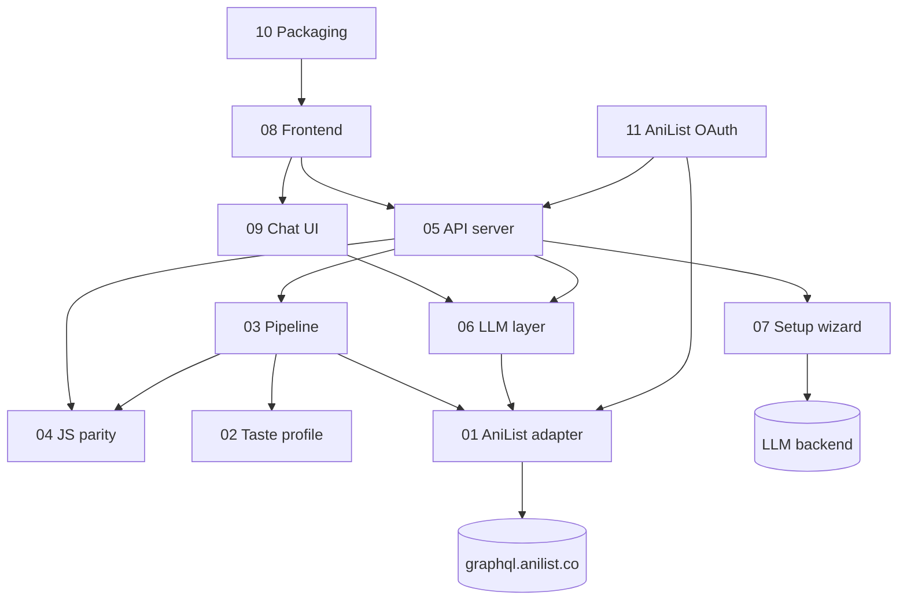

# Osusume — Code Wiki

> Synced at commit `d1fc973` · 2026-09-24 · generator: code-wiki (agent reports, orchestrator synthesis)

Navigable wiki of the codebase: one page per mechanism, each claim traced to `path:line`. Regenerated incrementally by SYNC (diff from the commit above), never by hand-edits to tracked sections.

## Pages

| # | Mechanism | Owns |
|---|---|---|
| 01 | [AniList adapter](meccanismi/01-anilist-adapter.md) | GraphQL client, rate limit, disk cache, fixtures mode |
| 02 | [Taste profile](meccanismi/02-taste-profile.md) | loved/disliked dims, sentiment, profile hash |
| 03 | [Recommendation pipeline](meccanismi/03-recommendation-pipeline.md) | candidates → franchise → scoring → MMR → why/whyNot |
| 04 | [JS parity & golden master](meccanismi/04-js-parity-golden.md) | js_compat, serialization, golden harness |
| 05 | [API server & configuration](meccanismi/05-api-server.md) | routes, errors, middleware, settings/config, local mode |
| 06 | [LLM layer](meccanismi/06-llm-layer.md) | client, prompts, explain cache, chat + card extraction |
| 07 | [Setup wizard & backend management](meccanismi/07-setup-wizard.md) | hardware, catalogue, download job, backend lifecycle |
| 08 | [Frontend app & views](meccanismi/08-frontend-app.md) | shell, data flow, components, i18n, tokens |
| 09 | [Chat UI: markdown & cards](meccanismi/09-chat-ui.md) | markdown subset renderer, bold→card protocol |
| 10 | [Desktop packaging & CI/CD](meccanismi/10-desktop-packaging.md) | Electron shell, PyInstaller, builder, workflows |
| 11 | [AniList OAuth & watchlist](meccanismi/11-anilist-oauth.md) | authorization code flow, loopback callback, token wiring, PLANNING mutation |

## Mechanism map

## Sync rules

- `git diff --name-only <synced-commit>..HEAD` → map touched files through each page's *Files covered* → regenerate only those pages.
- New file not covered → new page or merge into the owning mechanism. Orphan page → mark DEPRECATED here, never delete.
- Hand-written sections, if ever added, are preserved by SYNC.
