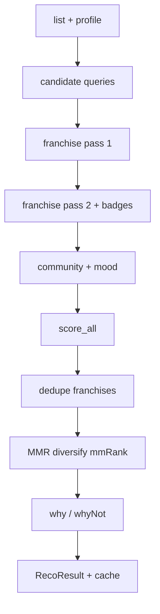

# 03 — Recommendation pipeline

**Abstract.** The deterministic engine: from username to a diversified, franchise-aware, explained `RecoResult` — with no LLM in the loop. The operation order is contractual (spec §2) and byte-parity-tested against the original TS server.

## Purpose

Answer "what should I watch next?" from the user's list only: targeted candidate discovery (AniList ToS forbids catalog mirroring), franchise logic, taste scoring, diversity, honest anti-recommendations.

## How it works (`recommend_for`, `backend/app/domain/pipeline.py:211-357`)

1. Fetch list (1 h disk cache) + build profile — `pipeline.py:213-214` ([02-taste-profile.md](meccanismi/02-taste-profile.md)).
2. **Candidates** (`fetch_candidates`, `pipeline.py:56-98`): top-3 loved genres × 2 popularity pages, top-5 loved tags × 1 page (`minimum_tag_rank: 60`), top-3 genres × 1 SCORE_DESC page (~14 requests); cold-start fallback = 2 global popularity pages. Single query failure tolerated; ALL failed → `AniListError` 502 (`pipeline.py:92-93`). Dedup by id, first wins, user's list excluded.
3. **Franchise pass 1** (`analyze_franchises`, `backend/app/domain/franchise.py:13-89`): PREQUEL chains (first edge wins), memoized walk with cycle guard, canonical `rootId = min(chain ids)`; a chain containing a DROPPED member → whole chain EXCLUDED; unseen entry points supersede their sequels unless the entry is already PLANNING (`pipeline.py:220-242`).
4. **Franchise pass 2** on the final pool: pulled-in entry points get the `ENTRY_POINT` badge (`pipeline.py:244-250`).
5. **Community signal**: recommendation graph of the top-5 loved entries; `communityPerHit 0.03` capped at 0.1, only for hits already in the pool; fetch failure = warn + skip (`pipeline.py:253-273`; weights `backend/app/shared/weights.py:20-21`).
6. **Mood continuity**: last 5 COMPLETED entries (by `updatedAt`); candidates sharing ≥4 plot tokens with them get `+0.04` (`pipeline.py:277-300`).
7. **Scoring** (`score_all`, `backend/app/domain/scoring.py:258-318`): `final = clamp(0.6·affinity + 0.28·quality + community + mood + NEXT_STEP·0.12, 0, 1.1)` (`scoring.py:292-300`). Affinity = 0.5 tag + 0.3 genre + 0.12 studio + 0.08 era over a neutralized `-1..1` map (`scoring.py:77-105`). Quality = `0.8·(averageScore ?? 60)/100 + 0.2·pop_norm` with `pop_norm = clamp((js_log10(pop+1)-2)/4, 0, 1)` (`scoring.py:108-112,68-74`) — V8 log10, see [04-js-parity-golden.md](meccanismi/04-js-parity-golden.md).
8. **Badges** in order NEXT_STEP, ENTRY_POINT (no bonus), SPIN_OFF, HIDDEN_GEM — gem iff `pop < 40k AND (averageScore ?? 0) ≥ 72 AND gem_score ≥ 0.45` where `gem_score = 0.65·aff + 0.35·quality − 0.3·pop_norm` (`scoring.py:115-133,281-312`).
9. **Diversity**: `dedupe_franchises` (one representative per `rootId`, survivors carry `groupSize`) THEN `diversify` MMR greedy λ=0.15 (`pairSim` = 0.5·genre-Jaccard + 0.5·same-studio), `mmRank` assigned — the UI default sort (`scoring.py:321-372`; `pipeline.py:313`).
10. **Plot-text links** (`text_links`): lexical links between candidate plots and positively-rated watched titles (`scoring.py:424`).
11. **Deterministic why / why-not**: `loved_overlap` (max 2 dims, rank ≥ 60 tags, `aff > 0.05` threshold) → expert-voice why; `deterministic_why_not` needs honest negative evidence (`aff < -0.3` disliked hits or a dropped prequel), max 3 `WhyNot` (`scoring.py:144-252`; `pipeline.py:326-355`).
12. Returns `RecoResult` (`pipeline.py:357`).

## Two worlds: `media_type` (post-manga)

`recommend_for`/`get_recommendation`/`lookup_media`/`score_arbitrary` take `media_type: "ANIME" | "MANGA"`: candidates, entry points, community graph and franchise read the matching world, while the **taste profile stays anime-only by design** (single profile — dims tag/genre share AniList's vocabulary). The manga list feeds exclusions/franchise/mood. The result-cache key includes the type (`user:lang:type:mode`, `pipeline.py`) so the two worlds never bleed into each other. Candidates carry no type field — runs are per-type, never mixed.

## Collaborative signal (`cf`, optional — post-port)

`score_all` accepts `cf_scores` (0..1 per candidate): when the CF artifact is downloaded, a cosine between an on-the-fly user vector (mean of the loved titles' item vectors) and the candidates adds `min(cfCap, cf·cf_score)` to `final`. With NO artifact the contribution is 0 and the engine is byte-identical to the TS original (golden included). The signal never touches the serialized payload — it moves the ranking only. Offline builder: `scripts/cf/` (Turan ratings + anime-offline-database ID join, ALS, recall-gated). Loader: `backend/app/adapters/cf.py`; state/toggle endpoint `GET|PATCH /api/cf` ([05-api-server.md](meccanismi/05-api-server.md)).

## Progress observation (`on_phase`, added post-port)

`recommend_for(username, lang, on_phase)` and `get_recommendation(..., on_phase)` accept a throw-free observer callback (`pipeline.py:211-217`, `:175-199`): 9 phase events — `list, profile, candidates, franchise, community, mood, scoring, links, whynot` — emitted at the exact boundaries above, NEVER reordering the work. Cache hit or inflight join → no callback (the caller receives only the final result). The SSE endpoint turns these into stream events ([05-api-server.md](meccanismi/05-api-server.md)); the UI renders a stepper ([08-frontend-app.md](meccanismi/08-frontend-app.md)).

## Result cache (`get_recommendation`, `pipeline.py:170-208`)

- In-memory, TTL 10 min, key `username:lang:mode` — mode (local/live) in the key so fixture results never resurface after returning live (`pipeline.py:182`).
- Fresh hit → return; expired + `stale_ok` → return; concurrent misses share one `_inflight` task (`pipeline.py:107,190-192`); compute error with `stale_ok` → expired value still wins (`pipeline.py:198-203`).

## Diagram

## Edge cases

- Every candidate query failing → 502 `anilist_error`.
- Entry-point fetch failure → extras ignored, pipeline continues.
- Ties: every sort replicates JS `Array.sort` stability with strict `>` comparisons.
- `dedupe_franchises` returns NEW objects instead of mutating (declared TS deviation, `scoring.py:3-5`).

## Dependencies

- AniList adapter for all fetches ([01-anilist-adapter.md](meccanismi/01-anilist-adapter.md)).
- Taste profile ([02-taste-profile.md](meccanismi/02-taste-profile.md)).
- JS-parity numerics for every float that reaches JSON ([04-js-parity-golden.md](meccanismi/04-js-parity-golden.md)).
- Served by the API server ([05-api-server.md](meccanismi/05-api-server.md)); its output seeds LLM prompts ([06-llm-layer.md](meccanismi/06-llm-layer.md)) and the frontend list logic ([08-frontend-app.md](meccanismi/08-frontend-app.md)).

## Files covered

- `backend/app/domain/pipeline.py`
- `backend/app/domain/scoring.py`
- `backend/app/domain/franchise.py`
- `backend/app/shared/weights.py`
- `backend/app/queries/recommend.py`
- `backend/app/queries/explain_query.py`

## Studio

1. Why dedupe franchises BEFORE MMR rather than after?
2. What does `mmRank` change for the user compared to sorting by `final`?
3. Why is HIDDEN_GEM impossible with a null `averageScore`?
4. Why is the result cache key keyed by local/live mode?
