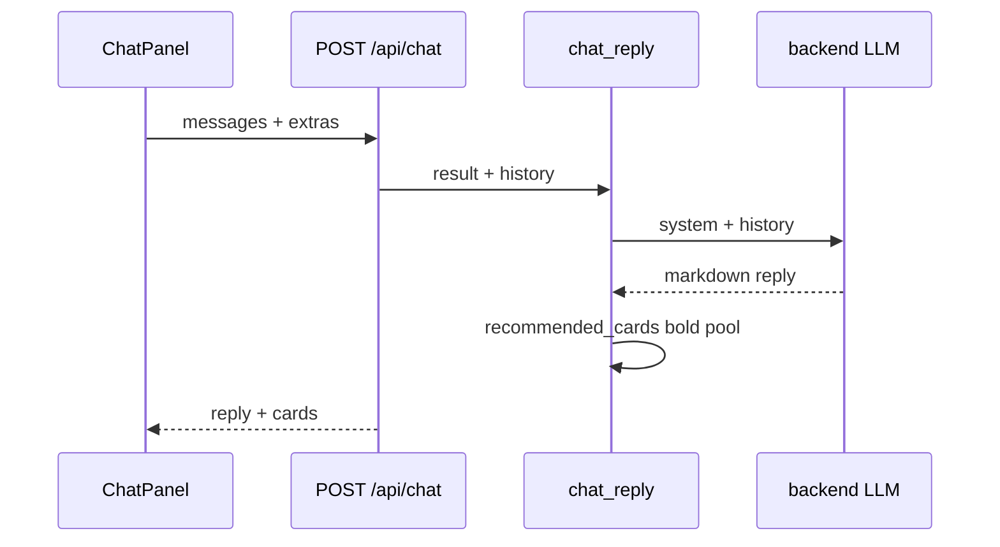

# 06 — LLM layer

**Abstract.** Local-first LLM integration over any OpenAI-compatible backend: a single client with thinking-model hardening, prompt doctrine copied verbatim from the TS era, a cached batch explanation pipeline, and a chat endpoint whose replies carry markdown and model-recommended anime cards.

## Purpose

Explain recommendations and chat in an expert friend's voice, powered by the backend the setup wizard installed (LM Studio / oMLX / Ollama / custom URL) — degrading to deterministic text, never to errors, when the model is off.

## Client (`backend/app/adapters/llm/client.py`)

- `llm_chat(messages, model, max_tokens)` (`client.py:102-151`): POST `{baseUrl}/chat/completions`, `temperature 0.3`, `repetition_penalty 1.12` (anti-loop for small quants; unknown fields dropped by servers), `chat_template_kwargs {"enable_thinking": false}` (Qwen3 hard switch — without it ~3 min of invisible reasoning), total timeout `LLM_TIMEOUT_MS` (300 s default) via `wait_for`.
- Post-processing: `finish_reason=length` → `LlmError("truncated")`; `<think>` blocks stripped; lone surrogates U+D800–DFFF removed (utf-8-safe cache writes); empty content → error (`client.py:140-150`).
- `is_truncation` + `LLM_RETRY_TOKENS` (4000) drive the one bigger-budget retry used by explain and chat (`client.py:36-43`).
- `llm_health()` (`client.py:71-81`): reachable AND the configured model (or its bare leaf) is actually served — a green chip that 404s on chat is worse than an honest off.
- `resolve_served_model()` (`client.py:84-96`): maps org/repo ids to the bare leaf the server serves.
- `served_models()` (`client.py:66-68`): raw `/models` ids for the settings UI.

## Prompts (`backend/app/adapters/llm/prompts.py`)

- `COMPARISON_STANDARD` (`prompts.py:51-56`): compare HOW stories work; leads are leads, not facts; ≤1-2 watched-title references; absorb reviews without ever naming reviewers; name craft.
- `clean_text` (`prompts.py:27-45`): HTML strip + ordered entity decode + word-boundary ellipsis.
- `build_prompt` (`prompts.py:88-131`): per-title plot/themes/reception/leads block; output contract = ONLY a JSON array; used by /explain.
- `build_chat_system` (`prompts.py:134-197`): expert friend persona, banned algorithm-speak, pool = `[*recos[:12], *extras[:5]]`, watched list ≤12, and the MARKDOWN rule: every recommended title in `**bold**` with the exact listed title; lists ≤5 items; headings/code/tables/HTML/links forbidden (`prompts.py:189`).
- `_owner_extra` (`prompts.py:62-72`): settings `systemPromptExtra` appended as OWNER NOTES to both prompts — never a replacement of the doctrine.

## Explain pipeline (`backend/app/adapters/llm/explain.py`)

Order is spec-locked (`explain.py:6-9`): cache key → pre-fill → model + reviews → batches ≤10 → truncation retry → corrective parse retry → break on LLM error → cache only genuine LLM text (atomic `.tmp` + `os.replace`).
- Cache key (`explain.py:44-53`): sha256 of `username|profile.hash|lang|model|baseUrl|PROMPT_VERSION|extra_hash|sorted-ids` — changing model, backend, or personal instructions invalidates cached prose (TTL 7 d).
- Parse (`backend/app/adapters/llm/parse.py:76-106`): string-aware balanced-bracket scan, tries spans last→first, JS `Number()` coercion, never throws (empty list on garbage).

## Chat & cards (`backend/app/adapters/llm/chat.py`)

- `chat_reply` (`chat.py:86-113`): system prompt + history; review grounding only for ≤2 mentioned + ≤3 looked-up focus ids (cap 4); one retry at 4000 tokens on truncation; other errors propagate to the 503.
- `recommended_cards(reply, pool)` (`chat.py:30-53`): `**bold**` spans (`_BOLD_RE`, `chat.py:22`) matched against the SAME pool the system prompt showed — exact case-insensitive, then bidirectional contains with a ≥4-char guard; dedup by id, appearance order, `CARDS_MAX=4`; unmatched bold is ignored, never invented.
- `card_payload` (`chat.py:56-68`): minimal card dict, `score = js_round(final*100)` (matches the frontend `score110`).
- The API assembles `{"reply", "cards"}` (`backend/app/api/routes.py:343-345`); the frontend renders markdown + cards (see [09-chat-ui.md](meccanismi/09-chat-ui.md)).

## Diagram

## Edge cases

- LLM unreachable → `LlmError` → 503 `llm_unavailable` (logged to `{DATA_DIR}/llm.log` via `log_llm`, `backend/app/adapters/llm/setup.py:68-78`).
- Explain failure mid-way → remaining titles keep deterministic `why` (never blank).
- Auth: `LLM_API_KEY` env > oMLX key when backend is omlx (`backend/app/adapters/llm/setup.py:47-65`).

## Dependencies

- Pipeline/profile for prompt inputs ([03](meccanismi/03-recommendation-pipeline.md), [02](meccanismi/02-taste-profile.md)); AniList reviews ([01](meccanismi/01-anilist-adapter.md)); `js_round` from parity ([04](meccanismi/04-js-parity-golden.md)); served by the API ([05](meccanismi/05-api-server.md)); backend lifecycle owned by the wizard ([07-setup-wizard.md](meccanismi/07-setup-wizard.md)).

## Files covered

- `backend/app/adapters/llm/client.py`
- `backend/app/adapters/llm/prompts.py`
- `backend/app/adapters/llm/explain.py`
- `backend/app/adapters/llm/parse.py`
- `backend/app/adapters/llm/chat.py`
- `backend/app/adapters/llm/setup.py`

## Studio

1. Why is `enable_thinking: false` sent as a body kwarg instead of a request header?
2. What exactly invalidates a cached explanation, and why is `systemPromptExtra` hashed into the key?
3. Why must the card pool mirror the prompt pool exactly?
4. Why can a lone surrogate crash a cache write, and where is it fixed?
