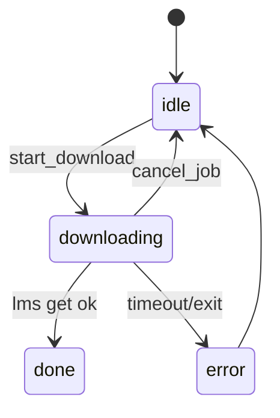

# 07 — Setup wizard & backend management

**Abstract.** Hardware detection, a two-tier model catalogue, a singleton download job with a kill ladder, and the lifecycle owner of the local LLM backend (LM Studio CLI or oMLX) — including auto-serve on startup and app-exit cleanup.

## Purpose

Make first run a wizard and every later run hands-off: detect the machine, suggest one model, download it through the right tool, start the backend, keep it alive, and shut it down with the app.

## Hardware & catalogue (`backend/app/adapters/system/setup.py`)

- `detect_hardware()` (`setup.py:89-99`): os, chip (`sysctl machdep.cpu.brand_string` on macOS, Rosetta-corrected), `ramGb` from `SC_PAGE_SIZE × SC_PHYS_PAGES`.
- `MODELS` (`setup.py:49-62`): `qwen36` (Qwen3.6-35B-A3B, gguf 21.5 GB / mlx 19.5 GB) and `gemma4` (Gemma 4 12B it, gguf 8.1 / mlx 6.3 GB), each with gguf/mlx/mlxLms/ollama variants.
- `suggest_model(hw)` (`setup.py:102-110`): Qwen3.6 iff `ramGb ≥ RAM_TRESHOLD_GB` (32 — TS typo intentionally preserved); MLX packs only on Apple silicon.
- `needs_setup_version` (`setup.py:113-117`): packaged only (`APP_VERSION` from Electron); a version bump reopens the wizard.

## Download job singleton

- State machine `idle | installing-cli | downloading | done | error` with a generation token; module-level `_job`, `_dl_child`, `_dl_abort` (`setup.py:344-363`).
- `start_download(model)` (`setup.py:375-410`): busy → `SetupError("busy")`; model key validated by `MODEL_KEY_RE` (no `..` tricks) → else `invalid_model`; missing `lms` → `lms_missing`; runs `lms get <model>` with a 1 h timeout, `--mlx` vs `--gguf` chosen from the repo name; success invalidates the `lms ls` cache and re-kicks `ensure_llm_server(True)`.
- `cancel_job()` (`setup.py:590-607`): bumps the generation (stales every writer), sets the abort event, SIGTERM → +5 s SIGKILL on the child, job back to `idle`.
- `run_lms` (`setup.py:239-295`): array-args exec (no shell), output ring-buffered into `job_feed` (2000 chars), shielded reaper so `wait_for` never cancels it, promise always settles (`code=-1` on forced kill).
- oMLX path `start_omlx_download` (`setup.py:497-576`): closed whitelist of 2 MLX repos; HF file list + HEAD sizes → exact progress; abort = back to `idle` without error.

## Backend lifecycle

- `ensure_llm_server(force)` (`setup.py:696-719`): short-circuits on custom env (compose/Docker owns the backend), wizard not done, in-flight lock (wins over force — two runs would leak a backend), throttle 60 s when up / 15 s otherwise; then fire-and-forget.
- `_ensure` → `auto_pick_backend()` (`setup.py:671-693`): only engines already on disk; model matched by `qwen3\.6|gemma-?4` regex else first.
- LM Studio branch (`setup.py:756-806`): `lms daemon up` → `lms server start` → model loaded with `--gpu=max --context-length=8192` (3 min timeout) → up to 10×2 s probes; a missing model routes an auto-get through the download singleton.
- oMLX branch (`setup.py:809-892`): probe `{base}/models` (4 s); if down, spawn `omlx serve` detached in its own process group with stdout/stderr appended to `llm.log`; 60×2 s readiness; model invisible after download → kill + respawn (oMLX scans models only at boot); external server → "manual restart needed".
- Ownership & cleanup: `_owned` tracks the spawned backend; `shutdown_backend()` (`setup.py:636-653`) kills the oMLX process group (SIGTERM tree) or `lms server stop`; registered via `atexit` in `cleanup_on_exit()` (`setup.py:665-668`) because uvicorn owns the signal handlers.

## Wizard routes (`/api/setup/*`, `setup.py:953-1115`)

- `GET /status`: hardware, suggested model, lms/omlx availability, `downloadedModels` (suppressed while a job runs), job payload, `llm.state` — "up" requires the configured model among served ids.
- `POST /ack` persists `setupDone`+`setupVersion`; `/download`, `/omlx-download`, `/cancel`, `/install-cli` (10 min hard stop), `/finish` (branch order: skipped → custom URL → omlx → lmstudio), `/reset` (unlinks config, cancels job).

## App update check (`backend/app/adapters/system/update.py`)

- `app_update_status(fresh)` (`update.py:54-66`): GitHub `releases/latest`, 5-min memo (anonymous rate limit), 5 s timeout, never raises; `available` iff `cmp_version(tag, current) > 0` with prerelease never counting as newer.

## Diagram

## Edge cases

- Two concurrent downloads → the second gets `busy` (409 at the API).
- `ensure` during an in-flight ensure → dropped (leak guard), not queued.
- Port from `omlx_base()` respected when spawning `omlx serve`; stale-while-revalidate `lms ls` cache (10 s) keeps `/status` snappy.

## Dependencies

- Config store for persistence ([05-api-server.md](meccanismi/05-api-server.md)); serves the backend the LLM layer talks to ([06-llm-layer.md](meccanismi/06-llm-layer.md)); drives the frontend wizard ([08-frontend-app.md](meccanismi/08-frontend-app.md)).

## Files covered

- `backend/app/adapters/system/setup.py`
- `backend/app/adapters/system/update.py`

## Studio

1. Why does the generation token exist alongside the kill ladder?
2. Why must oMLX be restarted after a download while LM Studio needs no restart?
3. What makes `ensure_llm_server` safe to call from every `/api/health` hit?
