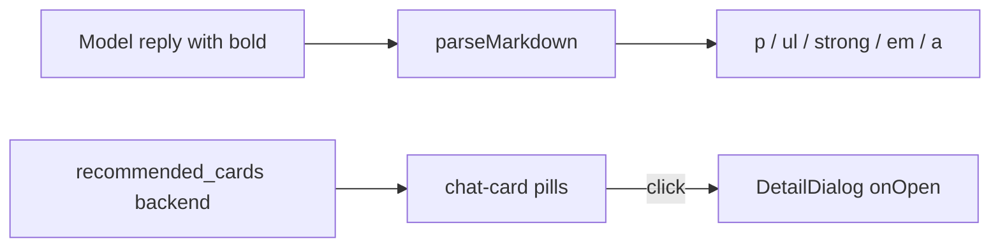

# 09 — Chat UI: markdown & anime cards

**Abstract.** The chat view renders LLM replies as conversational markdown (a hand-rolled ~50-line parser, zero dependencies, zero HTML strings) and attaches clickable anime cards for the titles the model itself bolded as recommendations — extracted server-side against the exact pool the prompt showed.

## Purpose

Make chat replies readable (emphasis, short lists, links) and actionable (open a title's detail with one click) without trusting the model with structured output: the marker is the bold it writes anyway, so degraded models simply produce no cards.

## Protocol

1. The system prompt mandates: every recommended title in `**bold**` with the exact listed title; lists ≤5 items; no headings/code/HTML/links (`backend/app/adapters/llm/prompts.py:189`).
2. The backend extracts bold spans and matches them against the prompt pool (`recommended_cards`, `backend/app/adapters/llm/chat.py:30-53`), producing the minimal card payload (`card_payload`, `chat.py:56-68`).
3. `POST /api/chat` answers `{"reply", "cards"}` (`backend/app/api/routes.py:343-345`). No bold in the reply → `cards: []` → text-only (previous behavior, never broken).
4. History hygiene: `ChatMsg.cards` is client-only; `_normalize_history` strips it from the wire so the model never sees stale card metadata (`backend/app/api/routes.py:310-319`, `frontend/src/lib/api.ts:63-65`).

## Markdown renderer (`frontend/src/lib/logic/markdown.ts` + `frontend/src/components/Markdown.tsx`)

- Pure data parser: blocks `p | ul`, inline `text | strong | em | link` (`markdown.ts:6-12`).
- `INLINE_RE = /\*\*([^*\n]+)\*\*|\*([^*\n]+)\*|\[([^\]\n]+)\]\((https?:\/\/[^\s)]+)\)/g` (`markdown.ts:14-16`): `**` before `*` (bold must win); href only http(s) — any other scheme (`javascript:`) simply doesn't match and stays visible text; bold never spans lines.
- Blocks split on blank lines; a list only when EVERY line starts `"- "` (`"* "` deliberately excluded — collides with italic) (`markdown.ts:33-47`).
- Everything outside the subset (headings, code, tables, HTML) renders as literal text — ugly but safe; the prompt forbids it.
- `Markdown.tsx` maps the tree to `p/ul/li/strong/em/a[target=_blank rel=noopener]` — React escapes all text, no `dangerouslySetInnerHTML` anywhere in the repo (`Markdown.tsx:13-45`).

## Chat panel (`frontend/src/components/ChatPanel.tsx`)

- State: `msgs`, `input`, `busy`, `err`, `elapsed`; autoscroll on new turns; 1 s thinking timer (`ChatPanel.tsx:18-37`); conversation resets on username/profile-hash change (`ChatPanel.tsx:40-43`).
- `send()`: history sliced to the last 12 + extras ids → `postChat`; assistant turn stores `{reply, cards}` (`ChatPanel.tsx:50-59`).
- Rendering: user messages stay plain `
` (pre-wrap keeps newlines); assistant messages render `<Markdown>` inside `.chat-msg.assistant.chat-md` (`ChatPanel.tsx:70-76`).
- Cards: pill buttons reusing the exact Topbar result markup — cover, title, `em` meta `score/110 · year` — click → `onOpen(cardToReco(c, [...result.recos, ...extras]))` (`ChatPanel.tsx:79-91`; resolver in `frontend/src/lib/logic/recos.ts:59-83`).
- Input locked while busy / no result / `llmOn === false`; errors are a single honest banner (the 503 code is not user-facing).
- CSS: `.chat-md` paragraph/list/link rules and the shared `.chat-card` pill (`frontend/src/styles.css:552-560`).

## Diagram

## Edge cases

- Model doesn't bold → no cards (accepted degradation, prompt is prescriptive).
- Bold on a title outside the pool → ignored (never invented); visually it's just emphasis.
- Truncated reply cutting a bold mid-span → regex simply doesn't match → no orphan card.
- `*italic*` single asterisks are emphasis only, never card markers.

## Dependencies

- Card extraction & chat flow: [06-llm-layer.md](meccanismi/06-llm-layer.md); endpoint contract: [05-api-server.md](meccanismi/05-api-server.md); shell wiring (extras state): [08-frontend-app.md](meccanismi/08-frontend-app.md).

## Files covered

- `frontend/src/components/ChatPanel.tsx`
- `frontend/src/components/Markdown.tsx`
- `frontend/src/lib/logic/markdown.ts`

## Studio

1. Why bold-as-protocol instead of asking the model for a trailing JSON array?
2. What is the XSS story when the model emits `<script>` or a `javascript:` link?
3. Why must the extractor pool equal the prompt pool, and what happens on a mismatch?
