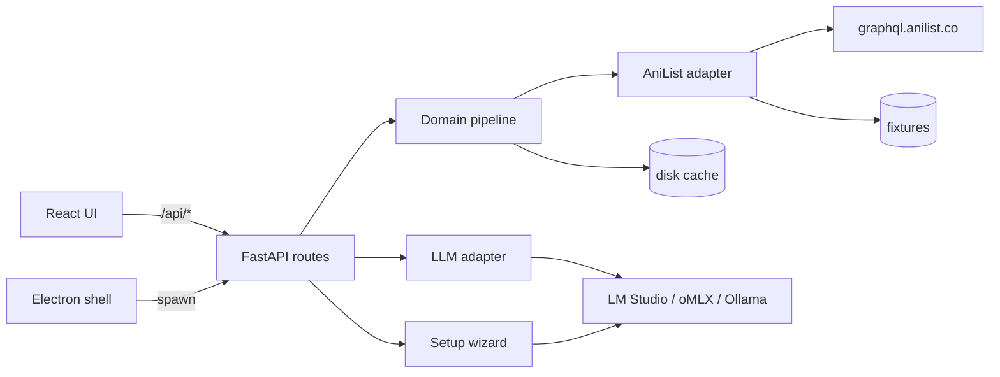

# Osusume — Overview

Self-hosted anime recommendations from your own AniList list: a deterministic taste profile, a local LLM for explanations and chat, hidden-gem detection, franchise awareness. No cloud, no accounts — everything runs on your machine.

## Stack

| Layer | Tech |
|---|---|
| Backend | Python 3.12, FastAPI, uvicorn, httpx (`backend/app/`) |
| Frontend | React 19 + Vite 6, TypeScript strict (`frontend/src/`) |
| Desktop | Electron shell + PyInstaller sidecar (`desktop/main.ts`, `scripts/build-pyserver.mjs`) |
| Tests | pytest (backend, 176+), `node --test` (frontend logic), golden master vs the original TS server |

The backend is a 1:1 port of the original Node/TypeScript server (`src/server/`, git history): behavior parity is contractual and enforced by a golden harness (see [04-js-parity-golden.md](meccanismi/04-js-parity-golden.md)).

## Entry points

- Dev backend: `pnpm dev` → `uv run --project backend run_dev.py` (uvicorn in-process, `backend/run_dev.py:16-29`).
- Dev frontend: `pnpm dev:ui` → Vite dev server proxying `/api` (`vite.config.ts:7-11`).
- App factory: `create_app` in `backend/app/main.py:43-60` — routers, error handlers, Host allowlist, SPA mount.
- Desktop: `desktop/main.ts` spawns the sidecar, waits for `/api/health`, opens the window.
- Package: `scripts/build-pyserver.mjs` (PyInstaller onedir) + `electron-builder.yml`.

## Architecture

## Wiki guide

- [concetti.md](concetti.md) — domain glossary (ScoredReco, badges, local mode…).
- Mechanism pages under [meccanismi/](meccanismi/): one page per mechanism, never per file. Each page ends with **Files covered** (the map SYNC uses) and **Studio** questions.
- `INDEX.md` header carries the last-synced commit: run SYNC after code changes.
